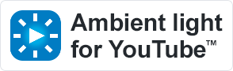
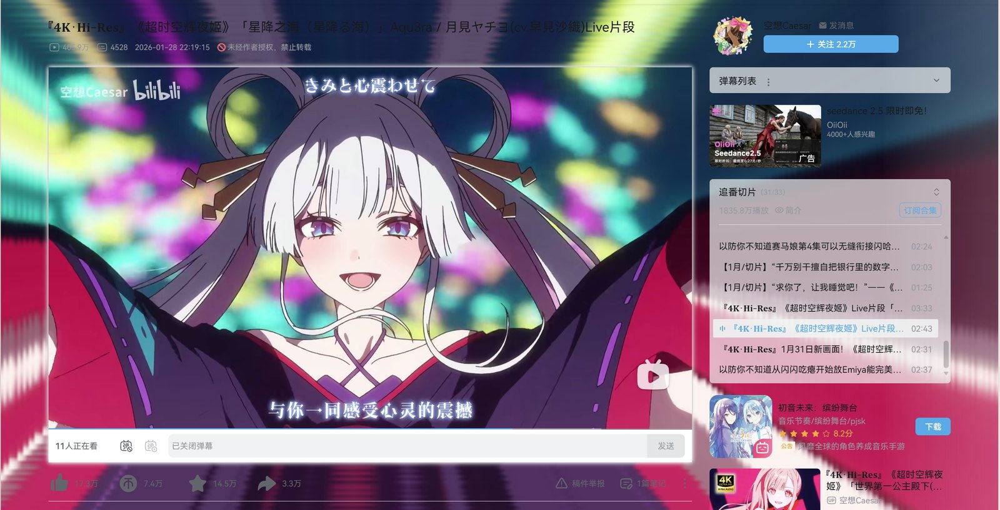
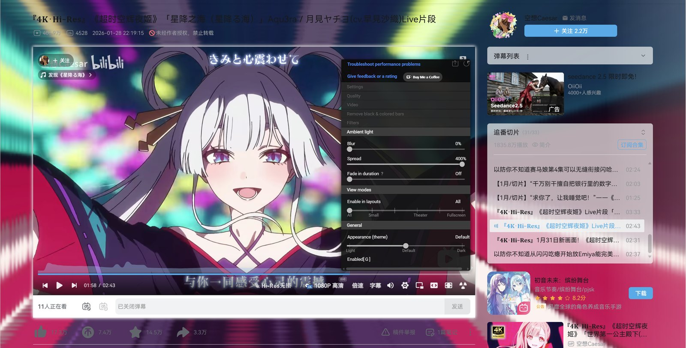
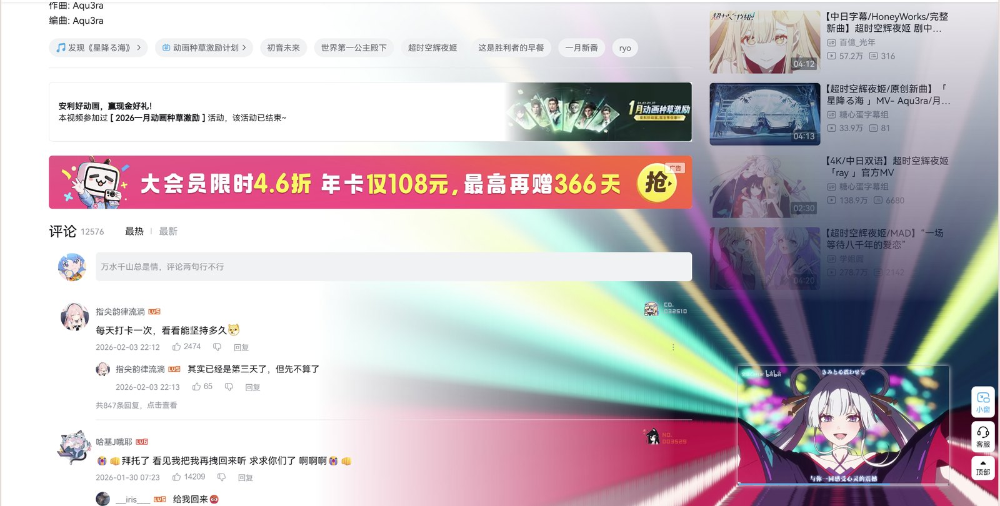

[](LICENSE) [](src/manifest.json) [](https://github.com/xiex16070-jpg/youtube-ambilight/stargazers)

<a href="https://github.com/xiex16070-jpg/youtube-ambilight#-%E6%94%AF%E6%8C%81%E4%BD%9C%E8%80%85" rel="noopener">
  
</a>

[](https://github.com/xiex16070-jpg/youtube-ambilight#readme)



# Ambient light for YouTube™ & Bilibili

> **作者 (Author)：** [Akari Akaza](https://github.com/xiex16070-jpg) · GitHub 昵称 **[@xiex16070-jpg](https://github.com/xiex16070-jpg)**
> **仓库 (Repository)：** <https://github.com/xiex16070-jpg/youtube-ambilight>
> **原项目 (Upstream)：** [WesselKroos/youtube-ambilight](https://github.com/WesselKroos/youtube-ambilight) · MIT

Immerse yourself in YouTube™ and Bilibili videos with ambient light!
让 YouTube™ 和 B 站（哔哩哔哩）的视频被氛围灯光包围 —— 不需要灯带、智能灯泡等额外硬件，一切都在浏览器里完成。

## ✨ 本分支做了什么（相对原版）

| | |
| --- | --- |
| **B 站支持** | `https://www.bilibili.com/video/*` 视频页 + `https://player.bilibili.com/*` 内嵌播放器 |
| **B 站布局适配** | 注入元素改为追加到内容节点末尾，避免被 Vue 镜像复用；播放器左侧不再被撑开，右栏标题/信息不再重复渲染 |
| **右侧列表可读** | 右栏卡片改为半透明，灯光可以透出来，同时文字保持原本的对比度（见 `bilibili-video-page.jpg`） |
| **小窗 / 全屏** | B 站小窗播放器保留光晕、全屏时灯光跟随播放器 |
| **Manifest V3** | Chrome / Edge 商店只接受 MV3，本仓库默认构建 MV3（同时保留 MV2 构建给 Firefox / 旧版本浏览器） |
| **打包脚本** | `npm run package` 直接生成可上传商店的 zip |

## 🖼 截图


| 设置菜单 | 小窗播放器 |
| --- | --- |
|  |  |

## 安装 Installation

### 本地加载（开发 / 自用）

1. 安装 [Node.js (LTS)](https://nodejs.org/en/download/) 后在项目目录执行：

```bash
npm install
npm run build      # 生成 /dist（Manifest V3）
```

2. 打开 `chrome://extensions/`（Edge 为 `edge://extensions/`）→ 打开「开发者模式」→「加载已解压的扩展程序」→ 选择 `dist` 文件夹。

> 需要 Firefox / 旧版浏览器？执行 `node manifest-copy.js --mv2` 重新写入 MV2 清单，或直接用 `npm run package` 生成的 `*-firefox-mv2.zip`。

### 商店安装（发布后）

Chrome Web Store 与 Microsoft Edge Add-ons 的上架包由 `npm run package` 生成，上架步骤见 [STORE-LISTING.md](STORE-LISTING.md)。
（上架完成后把商店链接补充到这里。）

## 最小配置要求 Minimum requirements

### 性能 Performance
建议使用 PassMark Video Card Benchmark 分数在 1000 分以上的显卡，可在 https://www.videocardbenchmark.net/gpu_list.php 查询。
分数较低时扩展仍可使用，但页面可能变慢或掉帧。
> 遇到性能问题请参考 [Troubleshoot guide](TROUBLESHOOT.md)。

### 浏览器版本 Browser versions
| 构建 | 浏览器 | 版本 | 说明 |
| ---- | ------ | ---- | ---- |
| Manifest V3（默认 `dist`） | Chromium / Edge | 121 | 商店版本 |
| Manifest V3（默认 `dist`） | Firefox | 121 | 需要 MV3 支持 |
| Manifest V2（`npm run package` 的 mv2 包） | Chromium | 80 | [可选链操作符 (?.)](https://caniuse.com/mdn-javascript_operators_optional_chaining) |
| Manifest V2（`npm run package` 的 mv2 包） | Firefox | 74 | [可选链操作符 (?.)](https://caniuse.com/mdn-javascript_operators_optional_chaining) |

## Privacy & Security
Read the [privacy policy](PRIVACY-POLICY.md)（扩展只在 `youtube.com` 与 `bilibili.com` 的视频页运行，除崩溃报告外不发送任何请求）。

## Report, request or contribute

Feel free to
- report bugs at [/youtube-ambilight/issues](https://github.com/xiex16070-jpg/youtube-ambilight/issues)
- request a feature at [/youtube-ambilight/issues](https://github.com/xiex16070-jpg/youtube-ambilight/issues)
- or ask a question at [/youtube-ambilight/issues](https://github.com/xiex16070-jpg/youtube-ambilight/issues)

也欢迎给原项目 [WesselKroos/youtube-ambilight](https://github.com/WesselKroos/youtube-ambilight) 点 Star、提 Issue 或 PR。

想给上游提 PR / 想了解上游的贡献要求与分支约定，见 [UPSTREAM-CONTRIBUTING.md](UPSTREAM-CONTRIBUTING.md)。

## 💝 支持作者

如果这个小扩展陪你多看了几个视频，欢迎 **点个 Star ⭐** 支持一下。

软件开发与调试对一个学生来说并不容易，你的 Star 就是最好的鼓励。

如果愿意请我一杯奶茶，也可以扫码捐赠，每一份支持我都记在心里 ❤️

<div align="center">

| 微信 | 支付宝 |
| :---: | :---: |
|  |  |

</div>

> 扩展内的链接也会跳到这里。（作者：Akari Akaza · https://github.com/xiex16070-jpg/youtube-ambilight）

## Development

```bash
npm install
npm run build           # rollup + sass + 复制清单/页面/图片 -> /dist
npm run build:dist      # 同上，但不做 Sentry sourcemap 处理
npm run package         # 构建并打包 releases/*.zip（商店包 + MV2 包）
```

- 源码目录：`src/`（`src/scripts/libs/ambientlight.js` 是核心渲染逻辑，`src/styles/content.scss` 是注入样式）
- 修改源码后重新 `npm run build`，再到 `chrome://extensions/` 点击扩展卡片上的刷新按钮。
- 上架清单文案与截图：[STORE-LISTING.md](STORE-LISTING.md)、`store/screenshots/`。

## 授权与致谢 License & credits

本分支基于 [WesselKroos/youtube-ambilight](https://github.com/WesselKroos/youtube-ambilight)（MIT License, Copyright (c) 2017 Wessel Kroos）二次开发，遵循同样的 MIT 协议，保留原作者的版权声明。

- 原项目：<https://github.com/WesselKroos/youtube-ambilight>
- 本分支修改：Copyright (c) 2026 Akari Akaza ([@xiex16070-jpg](https://github.com/xiex16070-jpg))
- YouTube™ 是 Google LLC 的商标，Bilibili / 哔哩哔哩 是其各自所有者的商标，本项目与它们无隶属关系。
